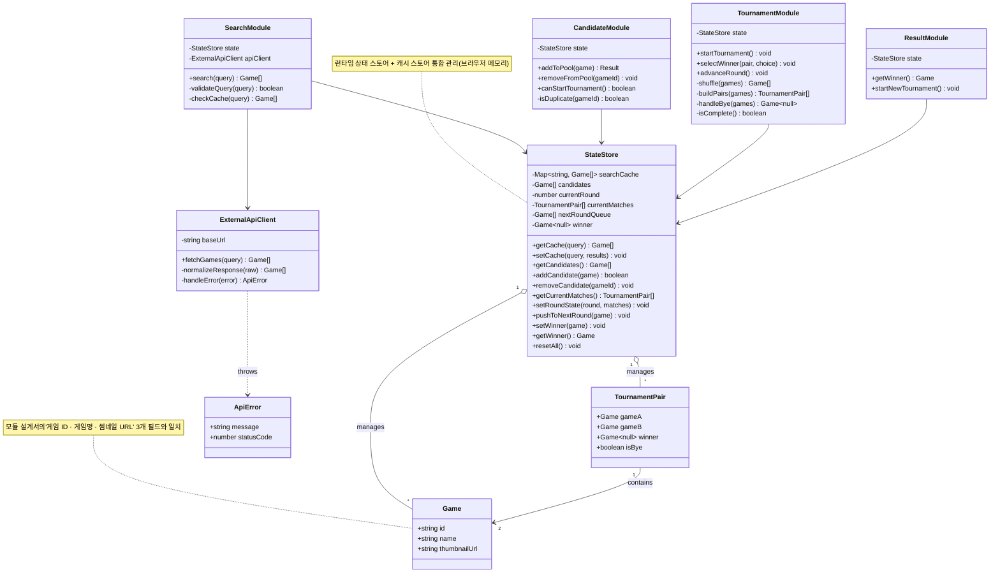

# 🎮 GameCup — 3대 UML 다이어그램 v1.1

> **버전:** v1.1  
> **생성 일자:** 2026.05.12  
> **이전 버전:** v1.0 (2026.05.12, 상태 다이어그램 포함)  
> **변경 사항:** 상태 다이어그램 → 액티비티 다이어그램 교체, 3계층 아키텍처 검증 추가

---

## 📅 변경 이력

|버전|일자|주요 변경|작성자|
|---|---|---|---|
|v1.0|2026.05.12|초안 작성 (클래스·시퀀스·상태 다이어그램)|-|
|v1.1|2026.05.12|상태 → 액티비티 다이어그램 교체, 3계층 검증 추가|-|

---

## 1. 클래스 다이어그램 (Class Diagram) v1.1

> **다이어그램 생성 일자:** 2026.05.12 (v1.1)  
> **변경점:** v1.0 대비 데이터 항목 일관성 검증 강화 (Game 필드 확정)

**목적:** 모듈 설계의 6개 모듈을 클래스로 구체화하고, 모듈 설계서의 데이터 항목과 1:1 일치시킨다.

### ✅ 데이터 항목 일관성 검증

모듈 설계서 "4. 데이터 저장 위치"와 클래스 필드 매핑:

|모듈 설계서 데이터 항목|클래스/필드 매핑|일치 여부|
|---|---|---|
|검색어별 API 응답 결과 (게임 ID · 게임명 · 썸네일 URL)|`StateStore.searchCache: Map<string, Game[]>` + `Game{id, name, thumbnailUrl}`|✅|
|후보 목록 배열|`StateStore.candidates: Game[]`|✅|
|현재 라운드 번호|`StateStore.currentRound: number`|✅|
|라운드 대결 쌍|`StateStore.currentMatches: TournamentPair[]`|✅|
|다음 라운드 진출 목록|`StateStore.nextRoundQueue: Game[]`|✅|
|우승 게임 정보|`StateStore.winner: Game`|✅|
|부전승 게임 정보|`TournamentPair.isBye: boolean`|✅|
|외부 게임 DB 메타데이터|`ExternalApiClient` (읽기 전용 외부)|✅|

---

## 2. 시퀀스 다이어그램 (Sequence Diagram) v1.1

> **다이어그램 생성 일자:** 2026.05.12 (v1.1)  
> **변경점:** 3계층 아키텍처(Presentation–Business–Data) 명시, UC별 4개로 분할 유지

### 🏛️ 3계층 아키텍처 매핑

|계층|역할|해당 컴포넌트|
|---|---|---|
|**Presentation**|사용자 입력/출력 처리|UI 컴포넌트 (View)|
|**Business**|도메인 로직, 규칙 검증|SearchModule, CandidateModule, TournamentModule, ResultModule|
|**Data**|상태 보관, 외부 API 통신|StateStore (메모리), ExternalApiClient (외부 DB 게이트웨이)|

**원칙:** Presentation은 Business만 호출, Business는 Data만 호출. 계층 건너뛰기 금지.

---

### 2.1 UC-01 게임 검색하기

![[Pasted image 20260512155426.png]]

**계층 검증:** User → [P] View → [B] SearchModule → [D] StateStore/ExternalApiClient. View가 직접 API를 호출하지 않고, Business 계층은 데이터 계층만 호출. ✅

---

### 2.2 UC-02 토너먼트 후보 구성하기

![[Pasted image 20260512155457.png]]

**계층 검증:** View가 직접 StateStore에 접근하지 않고 항상 CandidateModule을 경유. ✅

---

### 2.3 UC-03 토너먼트 진행하기

![[Pasted image 20260512155514.png]]

**계층 검증:** 라운드 자동 진행(F-08) 로직이 TournamentModule(Business)에 캡슐화되어 View는 결과만 받음. ✅

---

### 2.4 UC-04 최종 결과 확인하기

![[Pasted image 20260512155529.png]]

### ✅ 3계층 아키텍처 위반 사항 점검

|점검 항목|결과|
|---|---|
|Presentation이 Data를 직접 호출하는가?|❌ 없음 (모든 호출이 Business 경유)|
|Business가 Presentation을 알고 있는가?|❌ 없음 (Module은 View 모름)|
|Data가 Business 로직을 포함하는가?|❌ 없음 (StateStore는 CRUD만, 셔플·페어링은 Business)|
|계층 건너뛰기 (P → D) 존재?|❌ 없음|

---

## 3. 액티비티 다이어그램 (Activity Diagram) v1.1 🆕

> **다이어그램 생성 일자:** 2026.05.12 (v1.1, 신규)  
> **대상 기능:** UC-03 토너먼트 진행하기 (가장 복잡한 조건분기 + 반복 + 예외처리 포함)

**선정 이유:** UC-03은 13개 기능 요구사항 중 5개(F-06, F-07, F-08, F-09, NF-02)가 얽혀 있고, **시작 조건 검증 → 셔플 → 부전승 처리 → 라운드 반복 → 종료 판정**의 다단계 분기를 갖고 있어 액티비티 다이어그램으로 상세화하기 적합하다.

![[Search Query Result Flow-2026-05-12-065547.png]]

### 🔍 조건분기 및 예외처리 상세

|분기/예외|처리 내용|관련 요구사항|
|---|---|---|
|후보 수 < 2개|시작 버튼 비활성화, 토너먼트 진입 차단|F-06|
|후보 홀수|마지막 게임 부전승 마킹 후 자동 진출|F-09|
|부전승 페어|사용자 입력 없이 자동으로 nextRoundQueue 추가|F-09|
|입력 잠금 상태|연속/중복 클릭 무시 (선택 처리 중)|NF-02|
|무효한 선택|페어 멤버가 아닌 선택 시 롤백 후 재대기|NF-02|
|nextRoundQueue ≥ 2|다음 라운드 자동 구성 (셔플 단계 재진입)|F-08|
|nextRoundQueue = 1|우승 확정, 결과 화면 전환|F-10|
|nextRoundQueue = 0|치명적 오류 (정상 흐름에선 발생 불가), 안내|NF-02|

### ✅ 액티비티 다이어그램 검증

- **조건분기:** 7개 분기 노드 (마름모) 포함 ✅
- **예외처리:** 빨강(치명적/오류) · 주황(무시 처리) · 빨강 옅음(검증 실패) 색상으로 명시 ✅
- **반복 구조:** `ShowMatch` 루프 (페어 진행) + `CheckParity` 루프 (라운드 진행) ✅
- **모듈 설계 일관성:** TournamentModule의 메서드(`shuffle`, `buildPairs`, `handleBye`, `advanceRound`, `isComplete`)와 액티비티 노드가 1:1 매핑 ✅

---

## 4. 통합 검증 요약

### ✅ 기능 요구사항 커버리지 (PRD Iteration 3 v3.0)

|ID|기능|클래스|시퀀스|액티비티|
|---|---|:-:|:-:|:-:|
|F-01|게임 검색|✅|UC-01|-|
|F-02|검색 결과 표시|✅|UC-01|-|
|F-03|후보 등록|✅|UC-02|-|
|F-04|중복 등록 방지|✅|UC-02|-|
|F-05|후보 삭제|✅|UC-02|-|
|F-06|토너먼트 시작|✅|UC-03|✅|
|F-07|1:1 대결 진행 및 선택|✅|UC-03|✅|
|F-08|라운드 자동 진행|✅|UC-03|✅|
|F-09|부전승 처리|✅|UC-03|✅|
|F-10|결과 화면 표시|✅|UC-04|✅|
|F-11|API 오류 안내|✅|UC-01|-|
|F-12|빈 검색어 처리|✅|UC-01|-|
|F-13|새 토너먼트 시작|✅|UC-04|-|
|NF-02|안정성 (중복 입력 방지)|-|-|✅|
|NF-05|캐시 재활용|✅|UC-01|-|

### ✅ 3계층 아키텍처 일관성

- **Presentation:** SearchView, CandidateView, TournamentView, ResultView
- **Business:** SearchModule, CandidateModule, TournamentModule, ResultModule
- **Data:** StateStore (브라우저 메모리), ExternalApiClient (외부 게이트웨이)

모듈 설계서의 Client-Server-Data 구조와 정합. ✅

---

## 📅 다음 리비전 예정

|트리거|예상 변경|
|---|---|
|Iteration 4 PRD 확정 시|결과 저장/공유/랭킹 기능 추가 → Supabase 클래스 추가, 신규 시퀀스 다이어그램|
|사용자 인증 도입 시|User 액터 추가, 권한 검증 분기를 액티비티에 반영|
|성능 최적화 단계|캐시 만료 정책 액티비티 다이어그램 추가|

> 본 문서는 다이어그램이 수정될 때마다 **버전·생성 일자**를 갱신하여 반복적인 개선 이력을 유지한다.

---

