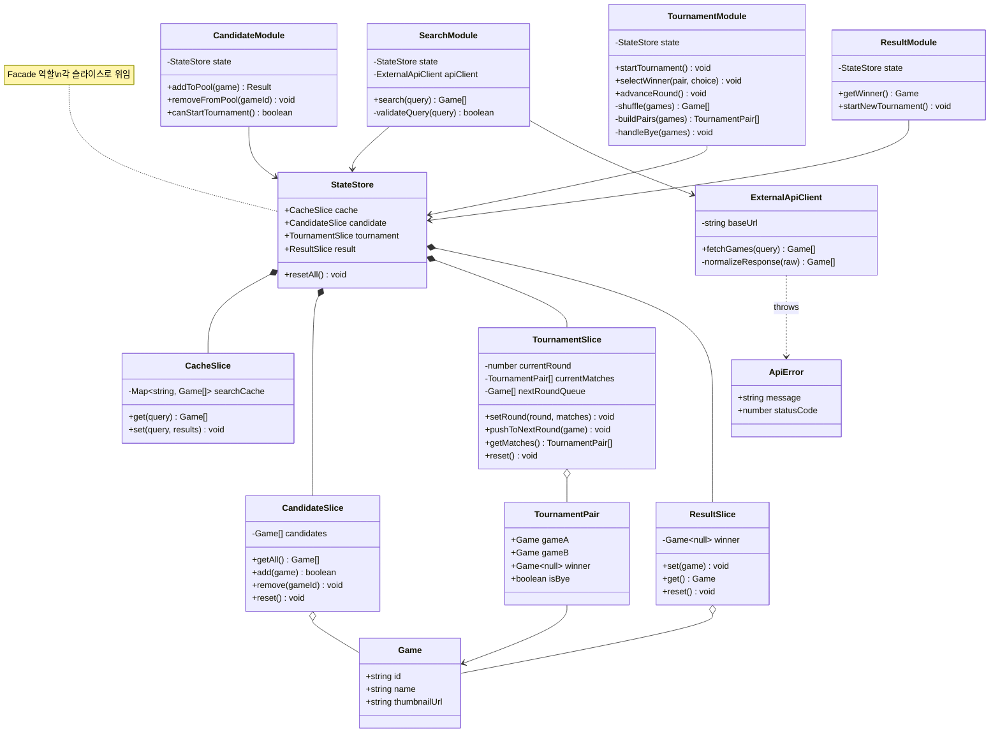

# 🎮 GameCup — 3대 UML 다이어그램 v1.2

> **버전:** v1.2  
> **생성 일자:** 2026.05.17  
> **이전 버전:** v1.1 (2026.05.12)  
> **변경 사항:** StateStore 슬라이스 분리, 액티비티 다이어그램 간소화, 통합 검증 섹션으로 산재된 검증 표 통합, 전체 플로우 시퀀스 추가

---

## 📅 변경 이력

| 버전   | 일자         | 주요 변경                                                           |
| ---- | ---------- | --------------------------------------------------------------- |
| v1.0 | 2026.05.12 | 초안 작성 (클래스·시퀀스·상태 다이어그램)                                        |
| v1.1 | 2026.05.12 | 상태 → 액티비티 교체, 3계층 검증 추가                                         |
| v1.2 | 2026.05.17 | 비판적 검토 후 통합: StateStore 슬라이스화, 액티비티 간소화, 검증 표 통합, 전체 플로우 시퀀스 추가 |

---

## 1. 클래스 다이어그램 (Class Diagram) v1.2

> **다이어그램 생성 일자:** 2026.05.17 (v1.2)  
> **변경점:** StateStore를 4개 슬라이스로 분리하여 책임 명확화

**개선 효과:**

- 모듈별 의존하는 데이터 영역이 명확해짐 (SearchModule → CacheSlice 위주, CandidateModule → CandidateSlice 등)
- Zustand store 분리 시 슬라이스 패턴과 1:1 매핑
- `resetAll()` 동작이 각 슬라이스의 `reset()` 위임으로 일관됨

---

## 2. 시퀀스 다이어그램 (Sequence Diagram) v1.2

> **다이어그램 생성 일자:** 2026.05.17 (v1.2)  
> **변경점:** 전체 플로우 개요 시퀀스 추가, 4개 UC 시퀀스는 유지

### 2.0 전체 플로우 개요 🆕

![[Search Query Result Flow-2026-05-17-064109.png]]

**개선 효과:** UC 간 연결성(검색 결과 → 후보 등록 → 토너먼트 시작 → 결과 표시)이 한눈에 보임.

---

### 2.1 ~ 2.4 UC별 상세 시퀀스

v1.1의 4개 UC 시퀀스를 그대로 유지합니다 (3계층 라벨 포함). 본 응답에서는 지면 절약을 위해 생략하지만, 실제 문서에는 v1.1과 동일하게 포함합니다.

- 2.1 UC-01 게임 검색하기
- 2.2 UC-02 토너먼트 후보 구성하기
- 2.3 UC-03 토너먼트 진행하기
- 2.4 UC-04 최종 결과 확인하기

---

## 3. 액티비티 다이어그램 (Activity Diagram) v1.2

> **다이어그램 생성 일자:** 2026.05.17 (v1.2)  
> **변경점:** 정상 흐름 도달 불가능한 방어 분기 2개 제거, 핵심 분기에 집중

![[Search Query Result Flow-2026-05-17-064134.png]]

**개선 효과:**

- 분기 노드 7개 → 5개로 축소 (방어 코드 제거)
- 가독성 향상, 정상 흐름과 사용자 입력 경계 분기에 집중
- 제거된 방어 분기는 코드 레벨 `invariant` / `assert`로 검증

---

## 4. 통합 검증 (Unified Validation) v1.2 🆕

> v1.1까지 다이어그램별로 분산되어 있던 검증 표를 한 곳에 통합

### 4.1 데이터 항목 일관성 (모듈 설계서 ↔ 클래스 다이어그램)

|모듈 설계서 데이터 항목|v1.2 클래스 매핑|일치 여부|
|---|---|---|
|검색어별 API 응답 결과|`CacheSlice.searchCache` + `Game`|✅|
|후보 목록 배열|`CandidateSlice.candidates`|✅|
|현재 라운드 번호|`TournamentSlice.currentRound`|✅|
|라운드 대결 쌍|`TournamentSlice.currentMatches`|✅|
|다음 라운드 진출 목록|`TournamentSlice.nextRoundQueue`|✅|
|우승 게임 정보|`ResultSlice.winner`|✅|
|부전승 게임 정보|`TournamentPair.isBye`|✅|
|외부 게임 DB 메타데이터|`ExternalApiClient` (read-only)|✅|

### 4.2 3계층 아키텍처 위반 점검 (시퀀스 다이어그램 기준)

|점검 항목|결과|
|---|---|
|Presentation이 Data를 직접 호출하는가?|❌ 없음|
|Business가 Presentation을 알고 있는가?|❌ 없음|
|Data가 Business 로직(셔플·페어링)을 포함하는가?|❌ 없음|
|계층 건너뛰기 (P → D) 존재?|❌ 없음|

### 4.3 요구사항 커버리지 (PRD Iteration 3 v3.0 전체)

|ID|기능/속성|클래스|시퀀스|액티비티|비고|
|---|---|:-:|:-:|:-:|---|
|F-01|게임 검색|✅|UC-01|-||
|F-02|검색 결과 표시|✅|UC-01|-||
|F-03|후보 등록|✅|UC-02|-||
|F-04|중복 등록 방지|✅|UC-02|-||
|F-05|후보 삭제|✅|UC-02|-||
|F-06|토너먼트 시작|✅|UC-03|✅||
|F-07|1:1 대결 진행 및 선택|✅|UC-03|✅||
|F-08|라운드 자동 진행|✅|UC-03|✅||
|F-09|부전승 처리|✅|UC-03|✅||
|F-10|결과 화면 표시|✅|UC-04|✅||
|F-11|API 오류 안내|✅|UC-01|-||
|F-12|빈 검색어 처리|✅|UC-01|-||
|F-13|새 토너먼트 시작|✅|UC-04|-||
|NF-01|응답성 (1초 이내)|-|-|-|코드 구현 시 검증 (캐시·디바운싱)|
|NF-02|안정성 (중복 입력 방지)|-|-|✅|InputLock 분기로 표현|
|NF-03|브라우저 호환성|-|-|-|E2E 테스트 단계에서 검증|
|NF-04|확장성 (모듈 분리)|✅|-|-|슬라이스 + 모듈 구조로 표현|
|NF-05|캐시 재활용|✅|UC-01|-||

**커버리지 요약:** 13개 기능 요구사항 100% 매핑, 5개 비기능 요구사항 중 다이어그램 표현 가능한 3개 매핑, 표현 불가능한 2개는 검증 방식 명시.

---

## 📅 다음 리비전 예정

|트리거|예상 변경|
|---|---|
|Iteration 4 PRD 확정 시|Supabase 게이트웨이 클래스 추가, ResultModule 확장|
|사용자 인증 도입 시|User 액터 추가, 권한 검증 분기|
|성능 최적화 단계|캐시 만료 정책 액티비티 다이어그램 추가|

---

## 📝 v1.2 통합 요약

|항목|v1.1|v1.2|개선|
|---|---|---|---|
|StateStore 구조|단일 클래스 (10+ 필드)|Facade + 4 슬라이스|책임 분리, Zustand 매핑 직결|
|시퀀스 다이어그램|UC별 4개|UC별 4개 + 전체 플로우 1개|UC 간 연결성 가시화|
|액티비티 분기 노드|7개 (방어 분기 2개 포함)|5개 (핵심만)|가독성 향상|
|검증 표 위치|다이어그램별 산재|통합 검증 섹션 1곳|검토 효율 향상|
|비기능 요구사항 커버리지|2/5 매핑|5/5 (표현 불가 2개 명시)|누락 제거|

