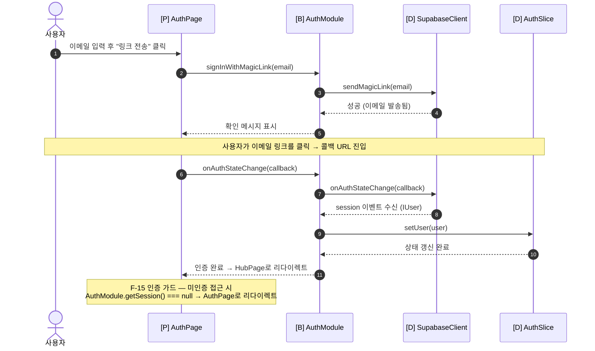
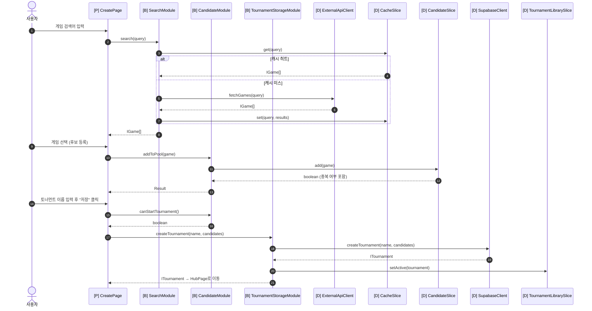
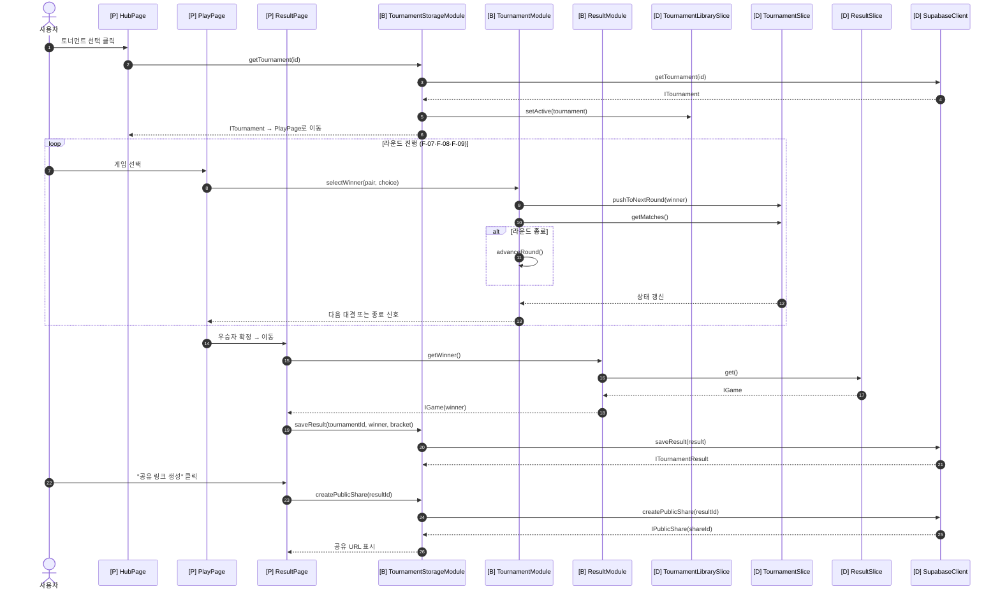

# GameCup — 3대 UML 다이어그램 v2.0

> **버전:** v2.0
> **생성 일자:** 2026.05.25
> **이전 버전:** v1.1 (2026.05.12, 현 베이스라인) / v1.2 (2026.05.17, Draft — StateStore 슬라이스 분리)
> **v1.2 Draft 흡수 여부:** v1.2의 StateStore 4-슬라이스 분리(CacheSlice / CandidateSlice / TournamentSlice / ResultSlice) 구조를 그대로 계승하여 v2.0에 흡수함. v1.2는 Draft로서 코드 미반영 상태였으므로 별도 이전 베이스라인으로 취급하지 않음.
> **주요 변경:** PRD Iteration 4(v4.0) — 멀티 토너먼트 + 사용자 인증(매직 링크) + 온보딩 + 결과 공유 구조로 메이저 확장. Data 계층에 SupabaseClient 추가, Business 계층에 AuthModule·TournamentStorageModule 신규 추가, 도메인 엔티티(User·Tournament·TournamentResult·PublicShare) 신규 정의, Store 슬라이스에 AuthSlice·TournamentLibrarySlice 추가.

---

## 변경 이력

| 버전 | 일자 | 주요 변경 | 분류 |
| --- | --- | --- | --- |
| v1.0 | 2026.05.12 | 초안 작성 (클래스·시퀀스·상태 다이어그램) | - |
| v1.1 | 2026.05.12 | 상태 → 액티비티 교체, 3계층 검증 추가 | 마이너 |
| v1.2 | 2026.05.17 | StateStore 슬라이스화, 검증 표 통합, 전체 플로우 시퀀스 추가 (Draft, 코드 미반영) | 마이너 Draft |
| v2.0 | 2026.05.25 | PRD Iteration 4 반영 — SupabaseClient(Data), AuthModule·TournamentStorageModule(Business), User·Tournament·TournamentResult·PublicShare 엔티티, AuthSlice·TournamentLibrarySlice(Store), Presentation 라우트 재편, 시퀀스 3개·액티비티 전면 재작성 | **메이저** |

---

## 1. 클래스 다이어그램 (Class Diagram) v2.0

> **다이어그램 생성 일자:** 2026.05.25 (v2.0)
> **변경점:** v1.2 대비 — 신규 도메인 엔티티 4종(User·Tournament·TournamentResult·PublicShare) 추가, Data 계층에 SupabaseClient 추가, Business 계층에 AuthModule·TournamentStorageModule 추가, StateStore 슬라이스에 AuthSlice·TournamentLibrarySlice 추가. 기존 6모듈 구조·슬라이스 구조 유지.

```mermaid
classDiagram
    %% ===== 도메인 엔티티 (신규 v2.0) =====
    class IUser {
        +string id
        +string email
    }
    note for IUser "Supabase Auth 사용자.\nPresentation·Business 간 전달 단위"

    class ITournament {
        +string id
        +string name
        +string ownerId
        +IGame[] candidates
        +string createdAt
    }
    note for ITournament "저장된 토너먼트(설문) 단위.\nF-16·F-17 핵심 엔티티"

    class ITournamentResult {
        +string id
        +string tournamentId
        +IGame winner
        +string playedAt
        +string~null~ bracketSummary
    }
    note for ITournamentResult "플레이 완료 후 저장되는 이력.\nF-19 핵심 엔티티"

    class IPublicShare {
        +string shareId
        +string tournamentId
        +string resultId
        +string createdAt
    }
    note for IPublicShare "공개 URL 공유 메타데이터.\nF-20 핵심 엔티티"

    %% ===== 기존 도메인 엔티티 (v1.2 계승) =====
    class IGame {
        +string id
        +string name
        +string thumbnailUrl
    }

    class ITournamentPair {
        +IGame gameA
        +IGame gameB
        +IGame~null~ winner
        +boolean isBye
    }

    class IApiError {
        +string message
        +number statusCode
    }

    %% ===== Data Layer: StateStore Facade + 6개 슬라이스 =====
    class StateStore {
        +CacheSlice cache
        +CandidateSlice candidate
        +TournamentSlice tournament
        +ResultSlice result
        +AuthSlice auth
        +TournamentLibrarySlice library
        +resetAll() void
    }
    note for StateStore "Facade 역할 (Zustand store)\n각 슬라이스로 위임"

    class CacheSlice {
        -Map~string, IGame[]~ searchCache
        +get(query) IGame[]
        +set(query, results) void
    }

    class CandidateSlice {
        -IGame[] candidates
        +getAll() IGame[]
        +add(game) boolean
        +remove(gameId) void
        +reset() void
    }

    class TournamentSlice {
        -number currentRound
        -ITournamentPair[] currentMatches
        -IGame[] nextRoundQueue
        +setRound(round, matches) void
        +pushToNextRound(game) void
        +getMatches() ITournamentPair[]
        +reset() void
    }

    class ResultSlice {
        -IGame~null~ winner
        +set(game) void
        +get() IGame
        +reset() void
    }

    class AuthSlice {
        -IUser~null~ currentUser
        +setUser(user) void
        +clearUser() void
        +getUser() IUser~null~
    }
    note for AuthSlice "신규 v2.0\nF-14·F-15 인증 상태 유지"

    class TournamentLibrarySlice {
        -ITournament[] myTournaments
        -ITournament~null~ activeTournament
        +setList(list) void
        +setActive(tournament) void
        +clearActive() void
        +getList() ITournament[]
        +getActive() ITournament~null~
    }
    note for TournamentLibrarySlice "신규 v2.0\nF-17 목록 캐시 + F-16 활성 토너먼트"

    %% ===== Data Layer: 외부 게이트웨이 =====
    class ExternalApiClient {
        -string baseUrl
        +fetchGames(query) IGame[]
        -normalizeResponse(raw) IGame[]
        -handleError(error) IApiError
    }
    note for ExternalApiClient "RAWG API 게이트웨이\n(v1.x 계승)"

    class SupabaseClient {
        -string supabaseUrl
        -string supabaseAnonKey
        +sendMagicLink(email) void
        +getSession() IUser~null~
        +onAuthStateChange(cb) void
        +signOut() void
        +createTournament(name, candidates) ITournament
        +listTournaments(ownerId) ITournament[]
        +getTournament(id) ITournament
        +deleteTournament(id) void
        +saveResult(result) ITournamentResult
        +listResults(tournamentId) ITournamentResult[]
        +createPublicShare(resultId) IPublicShare
        +getPublicShare(shareId) IPublicShare
    }
    note for SupabaseClient "신규 v2.0 — Data 계층 게이트웨이\nAuth + DB 접근 캡슐화\nPresentation 직접 import 금지 (NF-06·NF-07)"

    %% ===== Business Layer: 기존 4개 모듈 (v1.2 계승) =====
    class SearchModule {
        -StateStore state
        -ExternalApiClient apiClient
        +search(query) IGame[]
        -validateQuery(query) boolean
    }

    class CandidateModule {
        -StateStore state
        +addToPool(game) Result
        +removeFromPool(gameId) void
        +canStartTournament() boolean
    }

    class TournamentModule {
        -StateStore state
        +startTournament() void
        +selectWinner(pair, choice) void
        +advanceRound() void
        -shuffle(games) IGame[]
        -buildPairs(games) ITournamentPair[]
        -handleBye(games) void
    }

    class ResultModule {
        -StateStore state
        +getWinner() IGame
        +startNewTournament() void
    }

    %% ===== Business Layer: 신규 2개 모듈 (v2.0) =====
    class AuthModule {
        -StateStore state
        -SupabaseClient supabase
        +signInWithMagicLink(email) void
        +signOut() void
        +getSession() IUser~null~
        +onAuthStateChange(cb) void
    }
    note for AuthModule "신규 v2.0\nF-14·F-15 인증 플로우 담당"

    class TournamentStorageModule {
        -StateStore state
        -SupabaseClient supabase
        +createTournament(name, candidates) ITournament
        +listMyTournaments() ITournament[]
        +getTournament(id) ITournament
        +deleteTournament(id) void
        +saveResult(tournamentId, winner, bracket) ITournamentResult
        +listResults(tournamentId) ITournamentResult[]
        +createPublicShare(resultId) IPublicShare
        +getPublicResult(shareId) IPublicShare
    }
    note for TournamentStorageModule "신규 v2.0\nF-16·F-17·F-19·F-20 담당\nCandidateModule과 협력하여 후보→저장"

    %% ===== Presentation Layer 대표 화면 (참고용) =====
    class HubPage {
        <<Presentation>>
    }
    note for HubPage "메인 토너먼트 허브\nF-17 목록·F-18 온보딩·새로 만들기"

    class AuthPage {
        <<Presentation>>
    }
    note for AuthPage "매직 링크 요청 화면\n+ 콜백 처리 (F-14·F-15)"

    class CreatePage {
        <<Presentation>>
    }
    note for CreatePage "게임 검색·후보 등록·저장 (F-01~F-05·F-16)\n기존 SearchInput·CandidateList 재사용"

    class PlayPage {
        <<Presentation>>
    }
    note for PlayPage "토너먼트 진행 (F-06~F-09)"

    class ResultPage {
        <<Presentation>>
    }
    note for ResultPage "결과 표시 + 이력 저장 + 공유 링크 (F-10·F-19·F-20)"

    class PublicResultPage {
        <<Presentation>>
    }
    note for PublicResultPage "공개 결과 열람 — 비로그인 허용 (F-20)"

    %% ===== 관계 정의 =====

    %% StateStore 구성
    StateStore *-- CacheSlice
    StateStore *-- CandidateSlice
    StateStore *-- TournamentSlice
    StateStore *-- ResultSlice
    StateStore *-- AuthSlice
    StateStore *-- TournamentLibrarySlice

    %% 슬라이스 ↔ 엔티티
    CandidateSlice o-- IGame
    TournamentSlice o-- ITournamentPair
    ResultSlice o-- IGame
    ITournamentPair --> IGame
    AuthSlice o-- IUser
    TournamentLibrarySlice o-- ITournament
    ITournament o-- IGame
    ITournamentResult --> IGame
    ITournamentResult --> ITournament
    IPublicShare --> ITournamentResult

    %% Business → Data
    SearchModule --> StateStore
    SearchModule --> ExternalApiClient
    CandidateModule --> StateStore
    TournamentModule --> StateStore
    ResultModule --> StateStore
    AuthModule --> StateStore
    AuthModule --> SupabaseClient
    TournamentStorageModule --> StateStore
    TournamentStorageModule --> SupabaseClient

    %% 오류
    ExternalApiClient ..> IApiError : throws

    %% Presentation → Business (대표 관계)
    HubPage --> AuthModule
    HubPage --> TournamentStorageModule
    AuthPage --> AuthModule
    CreatePage --> SearchModule
    CreatePage --> CandidateModule
    CreatePage --> TournamentStorageModule
    PlayPage --> TournamentModule
    ResultPage --> ResultModule
    ResultPage --> TournamentStorageModule
    PublicResultPage --> TournamentStorageModule
```

### 데이터 항목 일관성 검증

PRD Iteration 4 v4.0 요구사항 ↔ 클래스/필드 매핑:

| PRD 데이터 항목 | 클래스/필드 매핑 | 관련 요구사항 | 일치 여부 |
| --- | --- | --- | --- |
| 인증 사용자 식별자·이메일 | `IUser{id, email}` / `AuthSlice.currentUser` | F-14·F-15 | ✅ |
| 토너먼트 이름·후보 세트·소유자 | `ITournament{id, name, ownerId, candidates, createdAt}` | F-16·F-17 | ✅ |
| 내 토너먼트 목록 캐시 | `TournamentLibrarySlice.myTournaments` | F-17 | ✅ |
| 활성(선택) 토너먼트 | `TournamentLibrarySlice.activeTournament` | F-17 | ✅ |
| 온보딩 진입 조건 | `TournamentLibrarySlice.myTournaments.length === 0` | F-18 | ✅ |
| 결과 이력 (우승자·플레이 시각·대진 요약) | `ITournamentResult{id, tournamentId, winner, playedAt, bracketSummary}` | F-19 | ✅ |
| 공개 공유 식별자 | `IPublicShare{shareId, tournamentId, resultId, createdAt}` | F-20 | ✅ |
| 검색어별 API 응답 (v1.2 계승) | `CacheSlice.searchCache + IGame` | F-01·NF-05 | ✅ |
| 후보 목록 배열 (v1.2 계승) | `CandidateSlice.candidates` | F-03·F-05·F-16 | ✅ |
| 현재 라운드·대결 쌍·진출 목록·우승자 (v1.2 계승) | `TournamentSlice.*` / `ResultSlice.winner` | F-06~F-10 | ✅ |
| RLS 보안 경계 | `SupabaseClient`(서버 측 RLS) + `ownerId` 필터 | NF-06 | ✅ |
| 세션 갱신 메커니즘 | `SupabaseClient.onAuthStateChange` + `AuthSlice` | NF-07 | ✅ |

---

## 2. 시퀀스 다이어그램 (Sequence Diagram) v2.0

> **다이어그램 생성 일자:** 2026.05.25 (v2.0)
> **변경점:** v1.2의 UC별 4개 시퀀스에 더해, Iteration 4 신규 플로우 3개 추가 (매직 링크 로그인 / 토너먼트 생성·저장 / 허브→플레이→결과 저장·공유). 기존 UC-01~UC-04 시퀀스는 Presentation 라우트명만 갱신하여 유지.

### 3계층 아키텍처 매핑

| 계층 | 역할 | 해당 컴포넌트 |
| --- | --- | --- |
| **Presentation** | 사용자 입력/출력 처리 | HubPage, AuthPage, CreatePage, PlayPage, ResultPage, PublicResultPage |
| **Business** | 도메인 로직, 규칙 검증 | SearchModule, CandidateModule, TournamentModule, ResultModule, AuthModule, TournamentStorageModule |
| **Data** | 상태 보관, 외부 통신 | StateStore(슬라이스), ExternalApiClient(RAWG), SupabaseClient(Supabase Auth+DB) |

**원칙:** Presentation은 Business만 호출, Business는 Data만 호출. 계층 건너뛰기·역방향 호출 금지.

---

### 2.1 매직 링크 로그인 (F-14·F-15)

**계층 검증:** User → [P] AuthPage → [B] AuthModule → [D] SupabaseClient/AuthSlice. Presentation이 SupabaseClient를 직접 호출하지 않음. ✅

---

### 2.2 토너먼트 생성·저장 (F-16)

**계층 검증:** 검색→후보→저장 전 과정이 Business를 경유. CreatePage는 SupabaseClient를 직접 알지 못함. ✅

---

### 2.3 허브 선택 → 플레이 → 결과 저장·공유 (F-17·F-19·F-20)

**계층 검증:** 허브 조회/결과 저장/공유 생성 전 과정이 TournamentStorageModule을 경유. ResultPage·HubPage가 SupabaseClient를 직접 호출하지 않음. ✅

---

### 3계층 아키텍처 위반 사항 점검 (전체 시퀀스 기준)

| 점검 항목 | 결과 |
| --- | --- |
| Presentation이 Data(StateStore·SupabaseClient·ExternalApiClient)를 직접 호출하는가? | ❌ 없음 (모든 호출이 Business 경유) |
| Business가 Presentation을 알고 있는가? | ❌ 없음 (Module은 Page/Component를 모름) |
| Data가 Business 로직(셔플·페어링·검증)을 포함하는가? | ❌ 없음 (SupabaseClient는 CRUD만) |
| 계층 건너뛰기 (P → D) 존재? | ❌ 없음 |
| Presentation이 supabaseClient를 직접 import하는가? | ❌ 없음 (AuthModule·TournamentStorageModule 경유 필수) |

---

## 3. 액티비티 다이어그램 (Activity Diagram) v2.0

> **다이어그램 생성 일자:** 2026.05.25 (v2.0)
> **대상 기능:** Iteration 4 전체 사용자 플로우 — 로그인 → 허브(온보딩 또는 목록) → 생성 또는 선택 → 플레이 → 결과·공유
> **변경점:** v1.2까지 UC-03(토너먼트 진행) 단독 다이어그램이었으나, v2.0에서는 인증·허브·온보딩이 추가됨에 따라 Iteration 4 전체 플로우를 포괄하는 다이어그램으로 재작성.

```mermaid
flowchart TD
    Start([앱 진입]) --> CheckSession{세션 존재?}

    CheckSession -->|없음| AuthPage[매직 링크 이메일 입력\nAuthPage]
    CheckSession -->|있음| HubPage[토너먼트 허브\nHubPage]

    AuthPage --> SendLink[매직 링크 발송\nAuthModule.signInWithMagicLink]
    SendLink --> WaitLink[링크 클릭 대기]
    WaitLink --> LinkClicked{링크 클릭됨?}
    LinkClicked -->|콜백 수신| SetSession[세션 저장\nAuthSlice.setUser]
    LinkClicked -->|만료/오류| AuthError[오류 안내 + 재시도]
    AuthError --> AuthPage
    SetSession --> HubPage

    HubPage --> CheckTournaments{저장된 토너먼트\n수 > 0?}

    CheckTournaments -->|0개 — 첫 사용자| OnboardingFlow[온보딩 시퀀스\nF-18]
    OnboardingFlow --> CreatePage
    CheckTournaments -->|1개 이상| ShowList[토너먼트 목록 표시\nF-17]

    ShowList --> UserHubAction{사용자 선택}
    UserHubAction -->|"새로 만들기"| CreatePage[토너먼트 생성\nCreatePage]
    UserHubAction -->|기존 토너먼트 선택| LoadTournament[토너먼트 불러오기\nTournamentStorageModule.getTournament]
    UserHubAction -->|토너먼트 삭제| DeleteTournament[삭제 처리\nTournamentStorageModule.deleteTournament]
    DeleteTournament --> HubPage

    CreatePage --> SearchGames[게임 검색\nSearchModule.search]
    SearchGames --> AddCandidate[후보 등록\nCandidateModule.addToPool]
    AddCandidate --> CheckDuplicate{중복?}
    CheckDuplicate -->|중복| DuplicateToast[중복 알림\nF-04]
    DuplicateToast --> SearchGames
    CheckDuplicate -->|정상 등록| CheckMin{후보 수 ≥ 2?}
    CheckMin -->|미달| SearchGames
    CheckMin -->|충족| SaveTournament[이름 입력 후 저장\nTournamentStorageModule.createTournament\nF-16]
    SaveTournament --> LoadTournament

    LoadTournament --> PlayPage[토너먼트 시작\nPlayPage\nF-06]
    PlayPage --> ShuffleAndPair[셔플·페어 생성\nTournamentModule.startTournament]
    ShuffleAndPair --> ShowMatch[대결 화면 표시]

    ShowMatch --> CheckBye{부전승 페어?}
    CheckBye -->|부전승| AutoAdvance[자동 진출\nF-09]
    AutoAdvance --> PushQueue[nextRoundQueue에 추가]
    CheckBye -->|정상 대결| WaitChoice[사용자 선택 대기]
    WaitChoice --> InputLock{입력 잠금 중?\nNF-02}
    InputLock -->|잠금| WaitChoice
    InputLock -->|가능| SelectWinner[승자 선택\nTournamentModule.selectWinner\nF-07]
    SelectWinner --> PushQueue

    PushQueue --> CheckRoundEnd{현 라운드\n대결 모두 완료?}
    CheckRoundEnd -->|미완료| ShowMatch
    CheckRoundEnd -->|완료| CheckFinal{nextRoundQueue\n크기?}

    CheckFinal -->|1 — 우승 확정| ResultPage[결과 화면\nResultPage\nF-10]
    CheckFinal -->|≥ 2 — 다음 라운드| AdvanceRound[라운드 전진\nTournamentModule.advanceRound\nF-08]
    AdvanceRound --> ShuffleAndPair

    ResultPage --> StoreSave[이력 자동 저장\nTournamentStorageModule.saveResult\nF-19]
    StoreSave --> ShowShareOption[공유 옵션 표시]

    ShowShareOption --> UserShareAction{공유 링크 생성?\nF-20}
    UserShareAction -->|생성| CreateShare[공유 URL 생성\nTournamentStorageModule.createPublicShare]
    CreateShare --> CopyLink[링크 복사 제공]
    CopyLink --> End
    UserShareAction -->|건너뜀| End

    End([종료 / 허브로 돌아가기])

    %% 스타일 — 오류/경계
    style AuthError fill:#ffcccc,stroke:#cc0000
    style DuplicateToast fill:#ffe0b2,stroke:#e65100
    style OnboardingFlow fill:#e8f5e9,stroke:#388e3c
```

### 조건분기 및 예외처리 상세

| 분기/예외 | 처리 내용 | 관련 요구사항 |
| --- | --- | --- |
| 세션 없음 | AuthPage로 이동, 매직 링크 발송 플로우 진입 | F-14·F-15 |
| 링크 만료/콜백 오류 | 오류 안내 후 AuthPage로 재진입 | F-14 |
| 저장 토너먼트 0개 | 온보딩 시퀀스(F-18) 진입 후 CreatePage 유도 | F-18 |
| 중복 후보 등록 | DuplicateToast 표시 후 검색 화면 유지 | F-04 |
| 후보 수 < 2 | 저장 버튼 비활성화, 계속 후보 추가 유도 | F-06·F-16 |
| 부전승 페어 | 사용자 입력 없이 nextRoundQueue 자동 추가 | F-09 |
| 입력 잠금 상태 | 연속/중복 클릭 무시 (선택 처리 중) | NF-02 |
| nextRoundQueue = 1 | 우승 확정, ResultPage 전환 | F-10 |
| nextRoundQueue ≥ 2 | 다음 라운드 자동 구성 (ShuffleAndPair 재진입) | F-08 |
| 결과 저장 선택 | F-19는 선택 기능 — 저장 없이 공유만도 가능 | F-19 |
| 공유 링크 생성 선택 | F-20은 선택 기능 — 생략 시 종료 | F-20 |

---

## 4. 통합 검증 요약 (Unified Validation) v2.0

### 4.1 3계층 배치 검증표

| 클래스/모듈 | 계층 | 주요 책임 | 신규 여부 |
| --- | --- | --- | --- |
| HubPage, AuthPage, CreatePage, PlayPage, ResultPage, PublicResultPage | Presentation | 사용자 입출력 | 신규 (Iteration 4 라우트 재편) |
| SearchModule | Business | 검색 + 캐시 전략 | v1.x 계승 |
| CandidateModule | Business | 후보 등록·삭제·중복 방지 | v1.x 계승 |
| TournamentModule | Business | 토너먼트 진행 로직 | v1.x 계승 |
| ResultModule | Business | 우승자 조회·초기화 | v1.x 계승 |
| AuthModule | Business | 인증 세션 관리 | **신규 v2.0** |
| TournamentStorageModule | Business | 토너먼트·결과 영속화 | **신규 v2.0** |
| StateStore (Facade) | Data | 슬라이스 통합·resetAll | v1.2 계승 |
| CacheSlice | Data | 검색 캐시 | v1.2 계승 |
| CandidateSlice | Data | 후보 목록 상태 | v1.2 계승 |
| TournamentSlice | Data | 라운드 진행 상태 | v1.2 계승 |
| ResultSlice | Data | 우승자 상태 | v1.2 계승 |
| AuthSlice | Data | 인증 사용자 상태 | **신규 v2.0** |
| TournamentLibrarySlice | Data | 토너먼트 목록·활성 토너먼트 상태 | **신규 v2.0** |
| ExternalApiClient | Data | RAWG API 게이트웨이 | v1.x 계승 |
| SupabaseClient | Data | Supabase Auth+DB 게이트웨이 | **신규 v2.0** |

**계층 건너뛰기 위반:** 없음 ✅
**역방향 호출 위반:** 없음 ✅
**Presentation → Data 직접 호출:** 없음 ✅

### 4.2 기능 요구사항 커버리지 (PRD Iteration 4 v4.0 전체)

| ID | 기능/속성 | 클래스 | 시퀀스 | 액티비티 | 비고 |
| --- | --- | :-: | :-: | :-: | --- |
| F-01 | 게임 검색 | ✅ | 2.2 | ✅ | SearchModule + ExternalApiClient |
| F-02 | 검색 결과 표시 | ✅ | 2.2 | ✅ | CreatePage |
| F-03 | 후보 등록 | ✅ | 2.2 | ✅ | CandidateModule.addToPool |
| F-04 | 중복 등록 방지 | ✅ | 2.2 | ✅ | CandidateSlice 중복 검사 |
| F-05 | 후보 삭제 | ✅ | - | - | CandidateModule.removeFromPool |
| F-06 | 토너먼트 시작 | ✅ | 2.3 | ✅ | TournamentModule.startTournament |
| F-07 | 1:1 대결 진행 및 선택 | ✅ | 2.3 | ✅ | TournamentModule.selectWinner |
| F-08 | 라운드 자동 진행 | ✅ | 2.3 | ✅ | TournamentModule.advanceRound |
| F-09 | 부전승 처리 | ✅ | 2.3 | ✅ | TournamentModule.handleBye |
| F-10 | 결과 화면 표시 | ✅ | 2.3 | ✅ | ResultModule.getWinner |
| F-11 | API 오류 안내 | ✅ | - | - | ExternalApiClient.handleError |
| F-12 | 빈 검색어 처리 | ✅ | - | - | SearchModule.validateQuery |
| F-13 | 새 토너먼트 시작 | ✅ | - | ✅ | ResultModule.startNewTournament → HubPage |
| F-14 | 사용자 인증 | ✅ | 2.1 | ✅ | AuthModule + SupabaseClient |
| F-15 | 인증 가드 | ✅ | 2.1 | ✅ | AuthModule.getSession + 리다이렉트 |
| F-16 | 토너먼트 생성·저장 | ✅ | 2.2 | ✅ | TournamentStorageModule.createTournament |
| F-17 | 내 토너먼트 목록·관리 | ✅ | 2.3 | ✅ | TournamentStorageModule.listMyTournaments |
| F-18 | 온보딩 시퀀스 | ✅ | - | ✅ | TournamentLibrarySlice 0개 조건 |
| F-19 | 결과 이력 저장·조회 | ✅ | 2.3 | ✅ | TournamentStorageModule.saveResult |
| F-20 | 결과 공유(링크) | ✅ | 2.3 | ✅ | TournamentStorageModule.createPublicShare |
| NF-01 | 응답성 (1초 이내) | - | - | - | CacheSlice + TanStack Query (코드 검증) |
| NF-02 | 안정성 (중복 입력 방지) | - | - | ✅ | 입력 잠금 분기 |
| NF-03 | 브라우저 호환성 | - | - | - | E2E 단계 검증 |
| NF-04 | 확장성 (모듈 분리) | ✅ | - | - | 슬라이스·모듈 구조 |
| NF-05 | 외부 호출 최소화 | ✅ | 2.2 | - | CacheSlice 캐시 히트 분기 |
| NF-06 | 데이터 보안·격리 (RLS) | ✅ | - | - | SupabaseClient + ownerId 필터 |
| NF-07 | 인증 세션 신뢰성 | ✅ | 2.1 | - | AuthModule.onAuthStateChange |

**커버리지 요약:** F-01~F-20 20개 기능 요구사항 100% 매핑, NF-01~NF-07 7개 비기능 중 다이어그램 표현 가능한 5개 매핑, 표현 불가능한 2개(NF-01·NF-03)는 검증 방식 명시.

---

## 5. 다음 리비전 예정

| 트리거 | 예상 변경 |
| --- | --- |
| Iteration 4 구현 완료 후 시그니처 확정 | 메서드 파라미터/반환 타입 세부 정합 → v2.1 마이너 |
| 비로그인 체험 모드 도입 결정 시 | 미인증 플로우 분기 추가 → 액티비티 갱신 |
| 캐시 만료 정책 구체화 | CacheSlice TTL 필드·액티비티 분기 추가 |
| Iteration 5 (이미지 공유·랭킹) 확정 시 | 신규 엔티티·모듈 추가 → v3.0 메이저 |

---

> 본 문서는 v1.1(코드 베이스라인) 및 v1.2(Draft)를 이전 버전으로 보존한 채 v2.0으로 신규 작성되었다. 이전 파일(`uml-v1.1.md`, `uml-v1.2.md`)은 수정하지 않는다.
>
> 다음 후속 작업:
> - **`code`**: AuthModule·TournamentStorageModule·AuthSlice·TournamentLibrarySlice·SupabaseClient 골격 코드 동기화
> - **`docs-changelog`**: v2.0 신규 작성 이력 `[Unreleased]` 기록
> - **마스터 플랜 §2 베이스라인**: UML v2.0으로 갱신, §4 아키텍처 표·§6 매핑 표에 F-14~F-20·신규 모듈 추가
